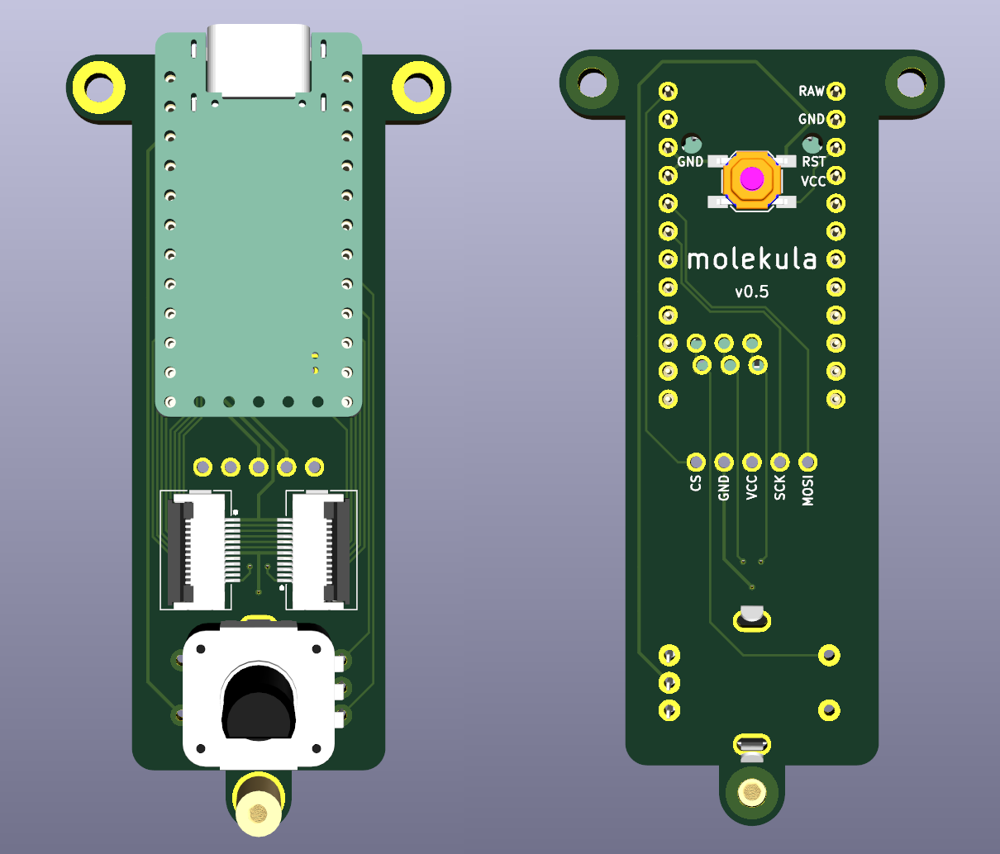
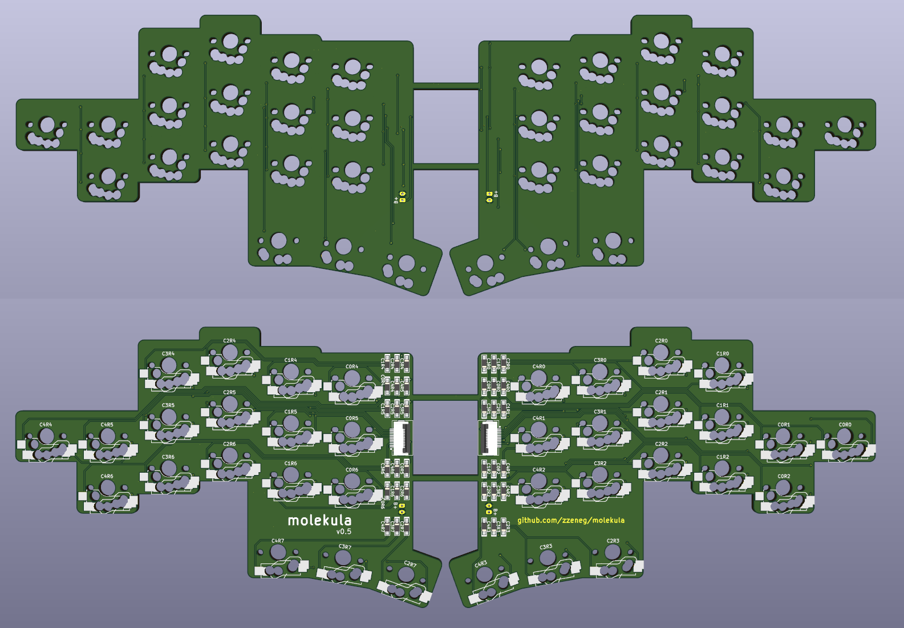
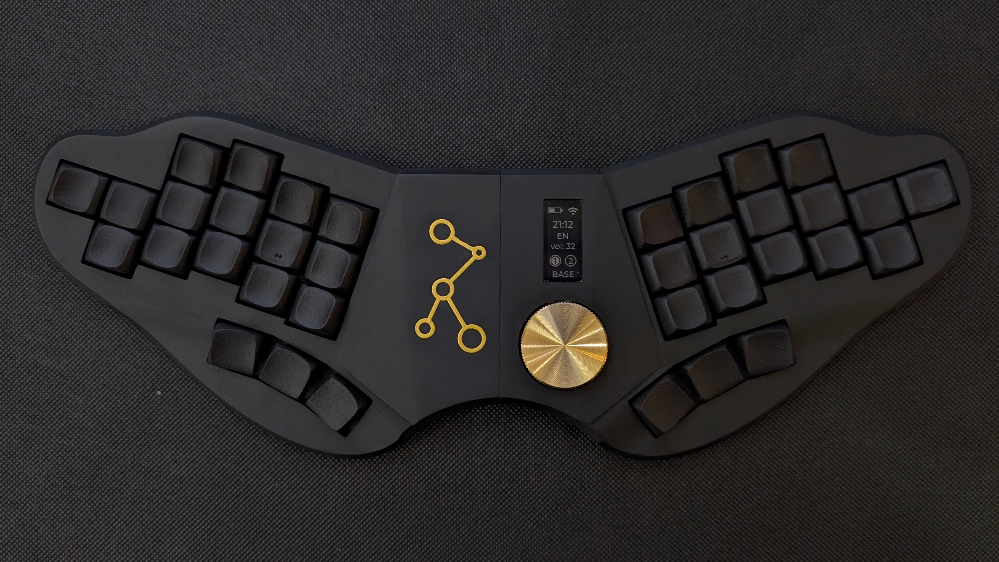
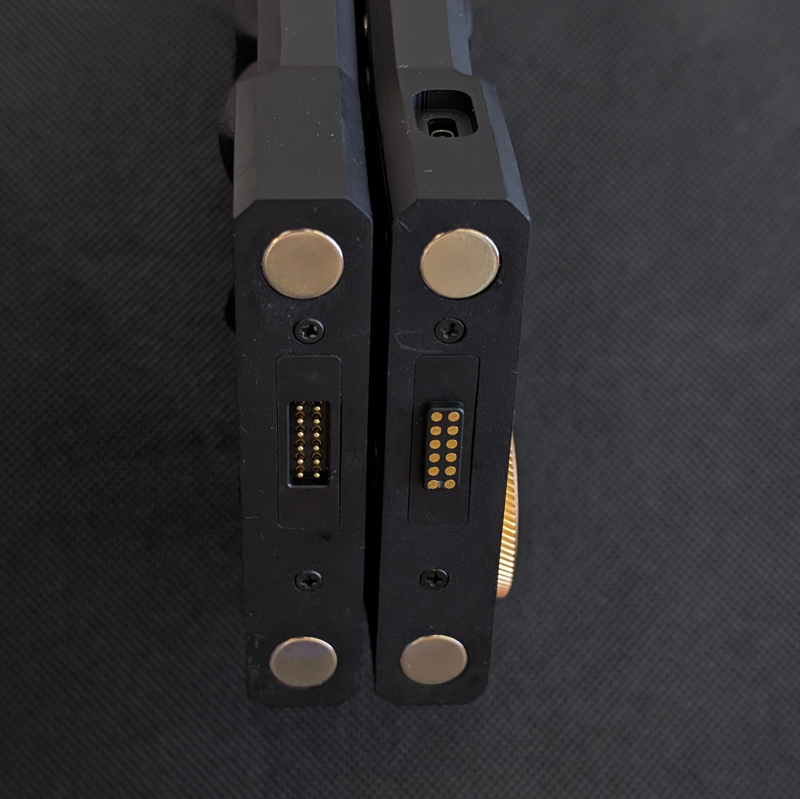

# molekula: keyboard & framework

## modular framework

This project aims to provide components for building modular ergo keyboards by separating one main PCB into central and side parts. **Side** is a dumb PCB, with key matrix only (up to 25 keys), and accepts all switch types (MX/ChocV1/ChocV2/GLP). **Central** is a keyboard brain, which contains any MCU (wired/wireless/integrated) and additional hardware - encoders/touchpads/trackballs/displays/etc, while keeping its size under 100x100mm. PCBs are interconnected with 12-pin FFC cables, and can be replaced/updated independently.

Such modular approach allows for quick, cheap and easy experimenting with different hardware, prototyping, and reusing of side PCBs.

### PCB examples

- central with pro-micro/nice!nano footprint, nice!view and rotary encoder

- side with 18 keys and minY spacing (19x16mm)

## Molekula keyboards

Reference design using molekula PCBs.

Features:

- minY (19x16mm) spacing
- 36 keys
- wireless
- nice!view support
- rotary encoder

### Molekula2

Unibody that can be disassembled into two parts for traveling

[More info and build guide](./keyboards/Molekula2/README.md)

### Molekula3

Unibody assembled from multiple parts, to allow easy modifications and experiments.

- optimised for FDM printing
- configurable angle and distance between sides (default is 18deg and 60mm)
- different options with dongle or nice!view
- MX/KS-33/ChocV1/ChocV2 are supported, except thumbs are low-profile only

[More info and build guide](./keyboards/Molekula3/README.md)

### minY keycaps

Keycaps designed for minY spacing (19mmx16mm):

- [MX DES](./keycaps/MX-DES-minY/)
- [Choc DES](./keycaps/MX-DES-minY/) - optimised for FDM printing

### Support

If you like my work and want to support my future designs, please consider [sponsorship](https://github.com/sponsors/zzeneg).

### Sponsors

Molekula2 keyboard was sponsored by PCBWay. I can highly recommend their PCBA and 3D printing services - "Imaging Black" resin looks fantastic.

