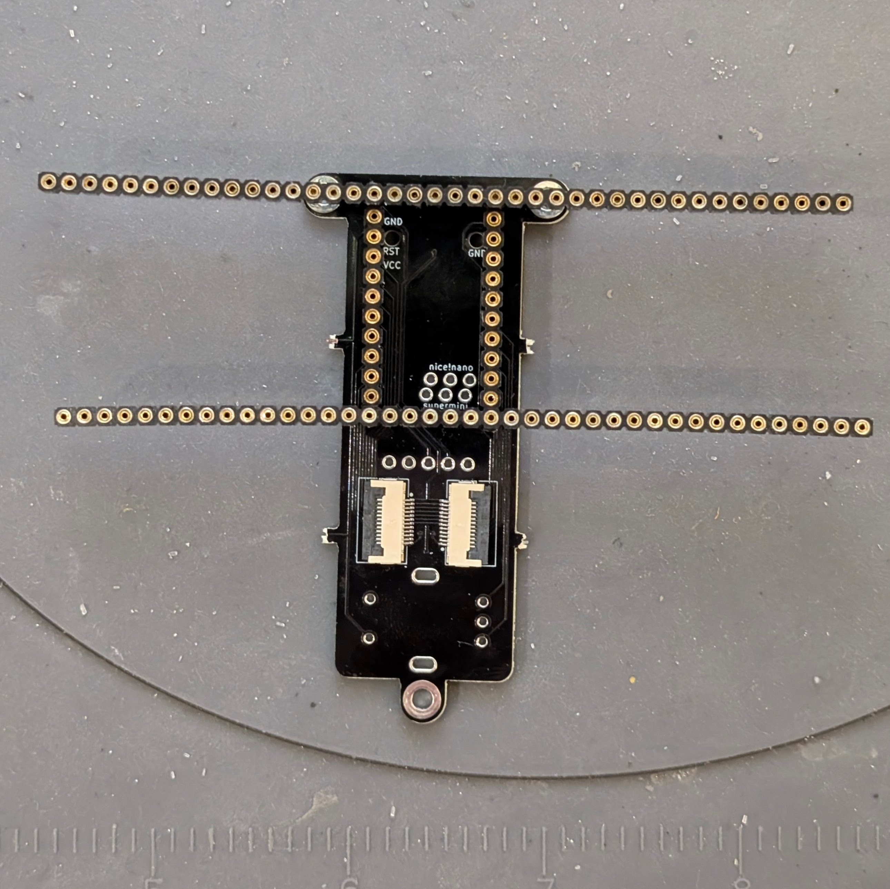
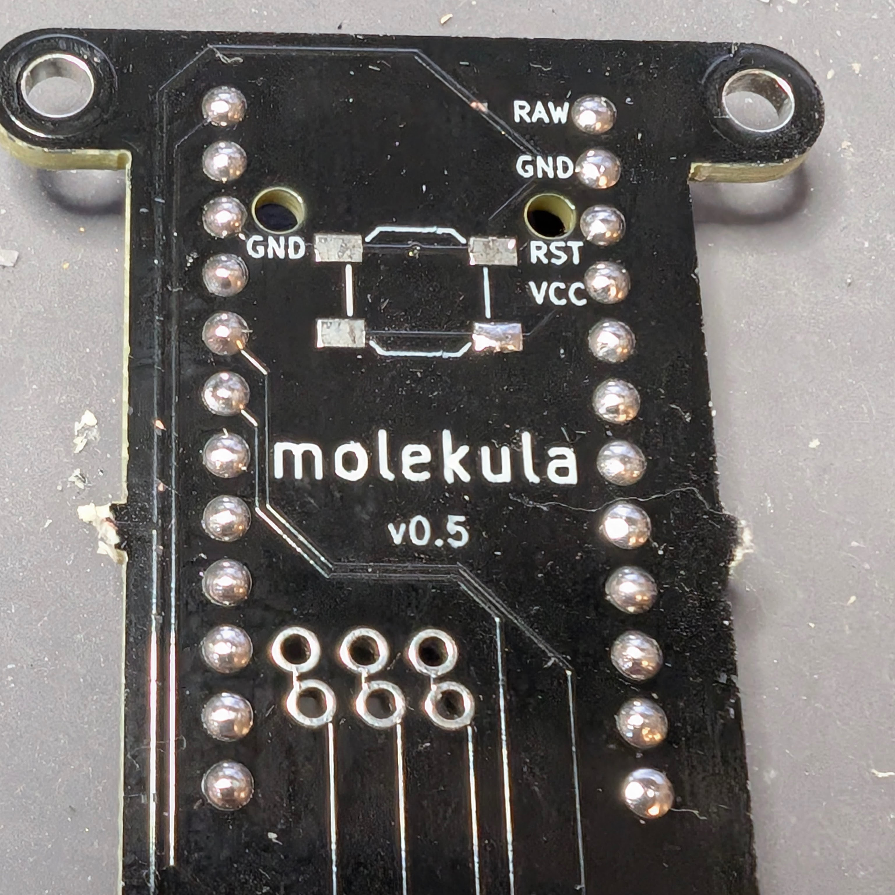
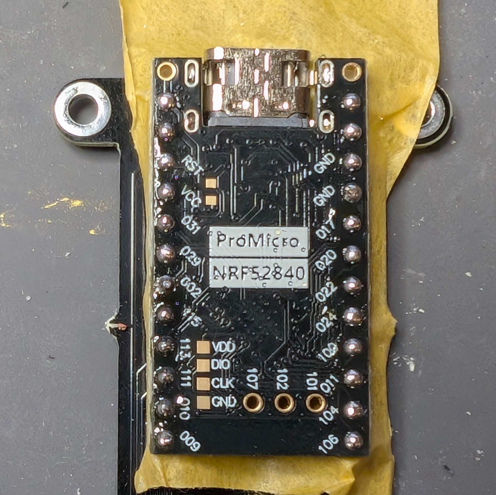
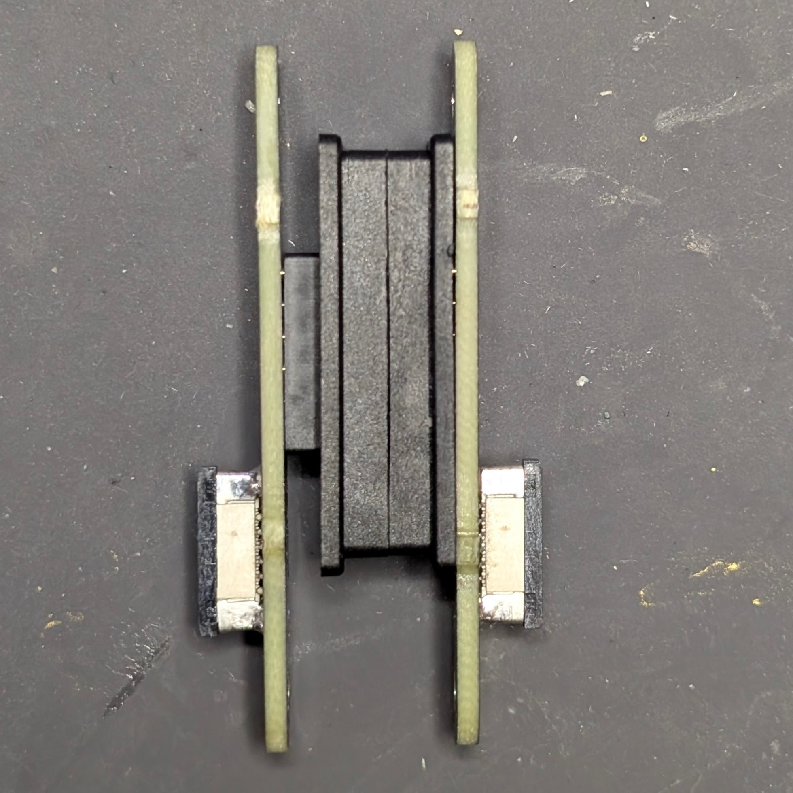

## Molekula2 keyboard

Reference design using molekula framework PCBs.

Features:

- minY (19x16mm) spacing
- unibody that can be disassembled into two parts for traveling
- 36 keys
- wireless
- nice!view support
- rotary encoder

## Firmware

- [molekula shield](https://github.com/zzeneg/zmk-molekula) with default keymap and ZMK Studio support
- [my custom keymap](https://github.com/zzeneg/zmk-config), can be used as reference if needed

## Bill of materials

- MCU - nice!nano _(recommended, please support original creator)_ or its chinese clone
- 36 MX/GLP/Choc hotswap sockets
- 36 MX/GLP/Choc switches
- 36 [SMD SOD-123 1N4148](https://www.aliexpress.com/item/1005002882901030.html) diodes
- Battery up to 602040 size - this is what I'm using, should be enough but you may try to go bigger (check that there's enough space inside using 3D project)
- _[Optional]_ Vertical 2pin 2.54mm JST [connector](https://www.aliexpress.com/item/1005004938361514.html) for battery
- [Magnetic connector 12pin](https://www.aliexpress.com/item/1005004609718442.html)
- 1 rotary encoder, [low profile EC12](https://www.aliexpress.com/item/1005003636548797.html) is recommended (no click though). Versions with click often has issues with power consumption, be careful
- 6mm, 8mm and 10mm [M2 screws with flat head](https://www.aliexpress.com/item/4001248931159.html) (choose black or silver based on case color/preference)
- [M2 nuts](https://www.aliexpress.com/item/1005001412230125.html)
- M2 3/4mm [heatset inserts](https://www.aliexpress.com/item/1005004624377733.html) - diameter 3.2mm for resin case or 3.5mm for thermoplastic
- Vertical 12pin 0.5mm [FFC/FPC connector](https://www.aliexpress.com/item/10000000737049.html)
- Horizontal 12pin 0.5mm [FFC/FPC connector](https://www.aliexpress.com/item/10000348360254.html)
- 12pin 0.5mm 5cm [FFC cable](https://www.aliexpress.com/item/1005007561337665.html) - grab both reverse and same side variants, in case you solder the connector upside down
- SMD 4x4x1.5mm [push button](https://www.aliexpress.com/item/32802382507.html)
- [7x1.5mm legs](https://www.aliexpress.com/item/1005002995402961.html)
- [10x3mm magnets](https://www.aliexpress.com/item/1005006802780901.html) - for connecting sides
- [8x2mm magnets](https://www.aliexpress.com/item/1005005426580014.html) - for transportation (optional)
- 2.54mm female pin [headers](https://www.aliexpress.com/item/4001122376295.html)
- 5pin [headers](https://www.aliexpress.com/item/1005005742644313.html) - source of pins for socketing, and also a connector for nice!view

## PCBA

PCBA is recommended, all PCBs are combined into one, BOM and Position files are tested. If you can manually solder FFC connectors with 0.5mm pitch (it's totally doable), ignore PCBA and order PCBs separately.

## Build guide

### Tools

- Soldering iron. Any iron will work, but I highly recommend something small like TS100 or Pinecil with TS-K tip, it's good for SMD soldering
- Solder wire, preferably with lead if you can get one. For EU I recommend this [shop](https://botland.store) and Cynel brand, 0.56mm and 0.9mm
- [Flux](https://www.aliexpress.com/item/1005004675178847.html)
- Flush cutters - be extra careful when cutting pins, always use eye protection
- Hot glue (for nice!view only), instant glue (for resin case only)
- Tweezers (I prefer [reverse](https://www.aliexpress.com/item/1005004188266714.html) instead of regular), pliers, soldering mat, isopropyl alcohol (IPA) and [cotton pads](https://www.aliexpress.com/item/1005003798227116.html) for cleaning

### Preparations

- download [latest firmware](https://github.com/zzeneg/zmk-molekula/actions), flash it to MCU and pair with your PC. It's easier to do it now and also check that MCU actually works
- read through the whole build guide
- break combined PCB into separate parts with pliers, do not sand break-offs

### Soldering

I used PCBA for final version, so I'll skip over FFC/diode soldering. Check my [duet guide](https://github.com/zzeneg/duet/blob/main/guide/readme.md) if needed.

#### Central

Start with MCU socketing (top side is the one with FFC connectors). Prepare MCU headers - you'll need two strips of 12 pins. Don't try to break the header between the pins, instead count the required number of pins, and break in middle of a next pin. Discard that pin and cut the plastic with flush cutters - it'll look much better. Assemble headers like this (using extra headers for stabilization):

Flip carefully and solder all pins starting from corners. I prefer to cut first and then solder but you can cut afterwards as well, just remember to do it as bottom case has only 1.2mm space there. Pins in the middle are used only for encoder click, ignore them if you don't use it.

Pull out 24 pins from RGB headers (I use two pliers for that) and put a piece of masking tape over all headers leaving some space in between for MCU components.

Align MCU holes with headers ignoring top row of holes on the MCU, they are not used/soldered. Insert pins one by one (cut them if you prefer but it's not required). Solder everything starting from corners.

Carefully pull out socketed MCU and remove tape. Now solder the nice!view header and reset button on the back. Finish central with rotary encoder. Done.

#### Magnetic connectors

Prepare two connector PCB with soldered FFC connectors (if soldering manually, make sure black part is facing the side where the breakoffs are). Put them onto magnetic connectors, the one with a "leg" should be on the left side, and FFC's black part should be facing you.

Take them apart and solder without flipping anything. It's a bit tricky because of magnets but doable with two hands. The easiest approach is to add a lot of flux and drag solder across all contacts.

#### Side PCBs

Just solder the hotswap sockets. They are not symmetrical, look at silkscreen on how to place them. Make sure that socket is fully inserted into the PCB. You have use a lot of solder as there are a lot of holes but try to avoid big solder blobs - they may collide with bottom case.

If you want a JST socket for the battery - solder it to the left PCB (JST should be on the top side). Double check the polarity on the battery connector, and do not connect it yet.

#### nice!view

Take a 5-pin header and carefully move pins, leaving around 1.5mm on one side - solder it to nice!view like that.

#### Assembly

Insert socketed MCU and attach all FFC cables. Connect everything outside the case for the first time, and perform basic checks for shorts between BAT/GND/VCC/B+/B-. If everything is ok, solder your battery to the PCB or connect it with JST.

Put screw inserts into the case. For thermoplastics (MJF, PLA, etc) use 3.5mm-wide and look at [this guide](https://docs.bastardkb.com/bg_charybdis/04screw_inserts.html) for detailed instructions on heat inserts. For resin case take 3.2mm inserts and use instant glue (cyanoacrylate) and/or a drill if the holes are too narrow.

Insert 10mm magnets, they should go all the way in so there is no gap between sides, use more force if needed. If loose, add a bit of instant glue inside.

Insert magnetic connector into the case - again, bigger one with "leg" should go the left (battery) side. Use 8mm and 10mm screws with hexes for them.

Attach nice!view to the case with hot glue - add more around the pins.
