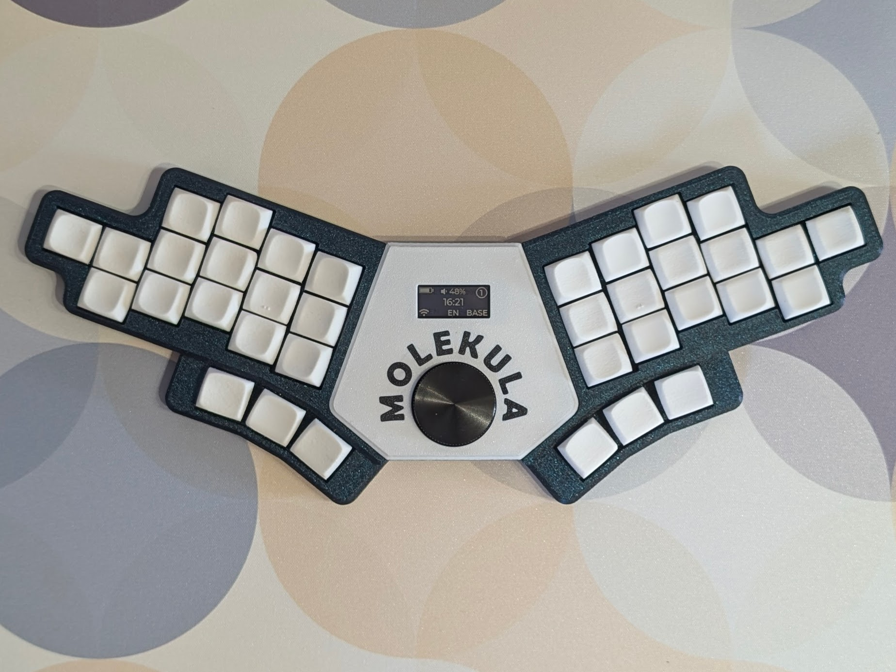
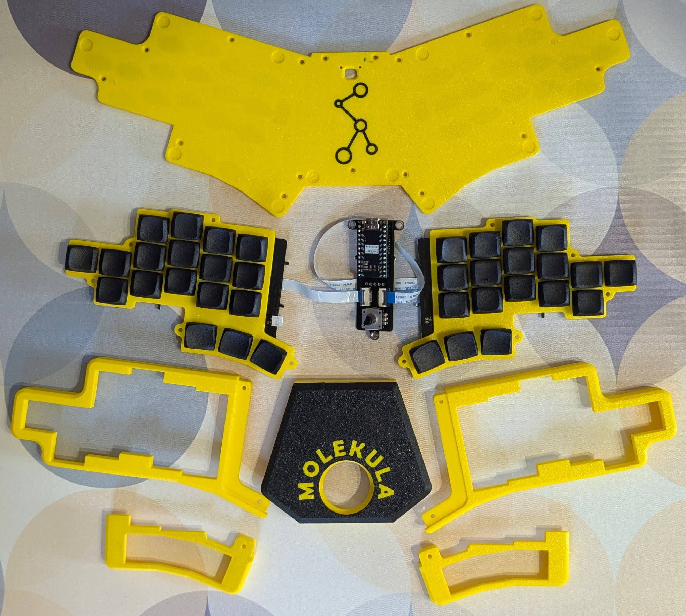
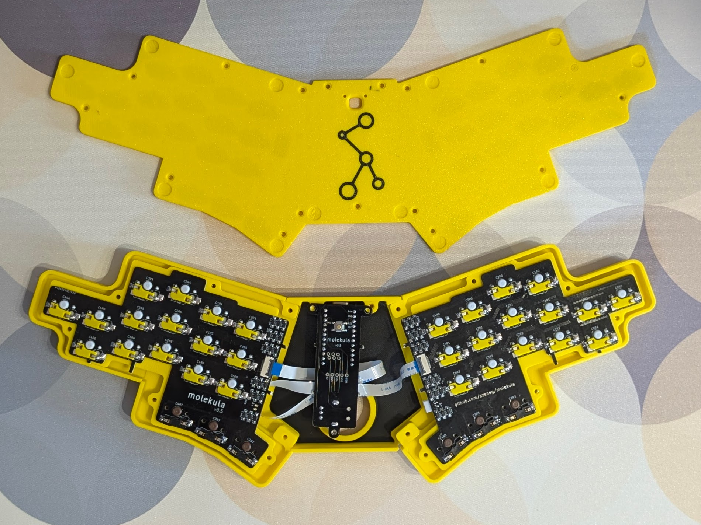
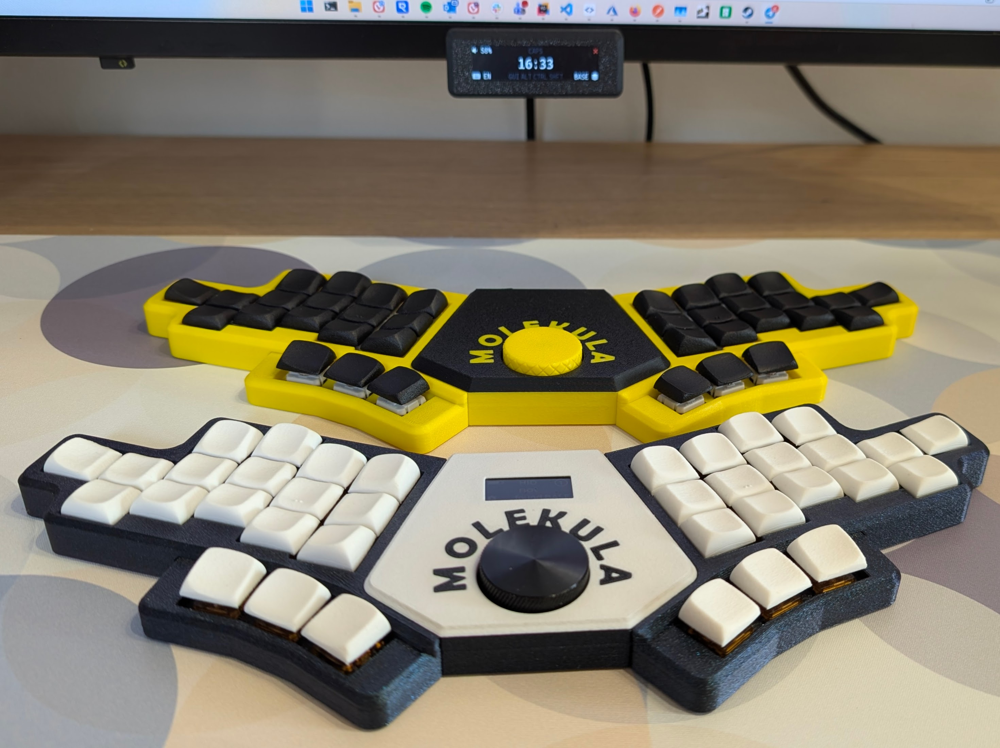

## Molekula3 keyboard

Unibody assembled from multiple parts, to allow easy modifications and experiments.

- optimised for FDM printing
- configurable angle and distance between sides
- different options with and without nice!view

## Firmware

- [molekula shield](https://github.com/zzeneg/zmk-molekula) with default keymap and ZMK Studio support, with variants for horizontal nice!view and [dongle](https://github.com/zzeneg/underdongle)
- [my custom keymap](https://github.com/zzeneg/zmk-config), can be used as reference if needed

## Bill of materials

- MCU - nice!nano _(recommended to support original creator)_ or its chinese clone
- 36 (30 MX/KS-33/Choc + 6 KS-33/Choc) switches
- 36 (30 MX/KS-33/Choc + 6 KS-33/Choc) hotswap sockets
- 36 [SMD SOD-123 1N4148](https://www.aliexpress.com/item/1005002882901030.html) diodes
- Battery like 902030 size - this is what I'm using, should be enough but you may try to go bigger (check that there's enough space inside using 3D project)
- _[Optional]_ Vertical 2pin 2.54mm JST [connector](https://www.aliexpress.com/item/1005004938361514.html) for battery
- 1 rotary encoder, [low profile EC12](https://www.aliexpress.com/item/1005003636548797.html) is recommended (no click though). Versions with click often has issues with power consumption, be careful
- 1 [30mm knob](https://www.aliexpress.com/item/1005001783212821.html) - or 3D printed one
- 8mm and 14mm [M2 screws with flat head](https://www.aliexpress.com/item/4001248931159.html) (choose black or silver based on case color/preference)
- [M2 nuts](https://www.aliexpress.com/item/1005001412230125.html)
- M2 2mm and 4mm [heatset inserts](https://www.aliexpress.com/item/1005004624377733.html) - diameter 3.2mm for resin case or 3.5mm for thermoplastic
- Horizontal 12pin 0.5mm [FFC/FPC connector](https://www.aliexpress.com/item/10000348360254.html)
- 12pin 0.5mm 5cm [FFC cable](https://www.aliexpress.com/item/1005007561337665.html) - reverse variant
- SMD 4x4x1.5mm [push button](https://www.aliexpress.com/item/32802382507.html)
- [7x1.5mm feet](https://www.aliexpress.com/item/1005002619943801.html)
- 2.54mm female pin [headers](https://www.aliexpress.com/item/4001122376295.html)
- 5pin [headers](https://www.aliexpress.com/item/1005005742644313.html) - source of pins for socketing, and also a connector for nice!view

## PCBA

PCBA is recommended, all PCBs are combined into one, BOM and Position files are tested. If you can manually solder FFC connectors with 0.5mm pitch (it's totally doable), ignore PCBA and order PCBs separately.

## Case

See STLs in [./case]() folder. Files are grouped into folders based on MX/LowProfile and exact switches. Feel free to modify the Fusion 360 files for custom dimensions.

Printing should be easy, supports are required only for the left/right sides.

If you don't want/like logos, just combine STLs into one.

## Build guide

See [build guide for molekula2](./../Molekula2/README.md), just ignore everything about connectors and magnets.

Use 2mm heatset insert for central and thumb parts, and 4mm for sides.
